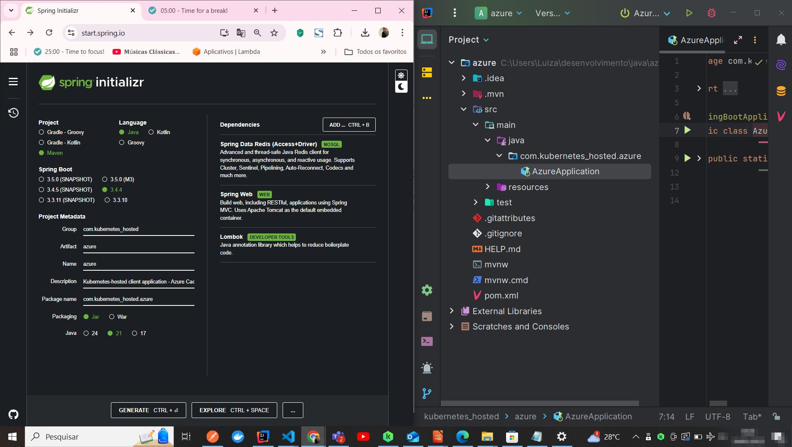
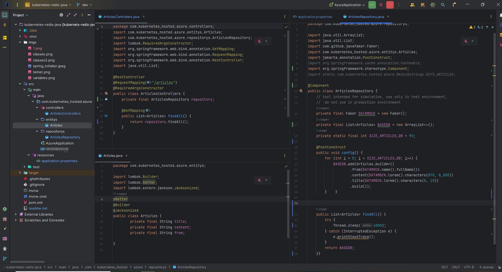
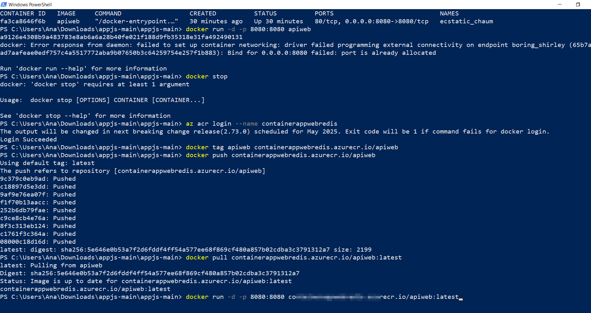

# Redis with Spring Boot

[](https://skillicons.dev)

Benefitis of Redis:


- Agility, which positively impacts the customer experience;
- Useful for recommendation systems;
- Integrates with many programming languages ​​and frameworks;
- Data replication;
- Uninterrupted service;
- Reduction of financial waste due to the reduction of unnecessary requests to the microservice or database, located in the provider's cloud.
    <i>
        
    "Many applications use backend databases, such as SQL Server, when applications require frequent access to data. The cost of maintaining these backend services to cope with demand can be high, but you can use an effective caching strategy to reduce load on backend databases by reducing sizing and scaling requirements. This can help you reduce costs and improve the performance of your applications. Caching is a useful technique to save on costs related to read heavy workloads that use more expensive resources such as SQL Server. (https://docs.aws.amazon.com/prescriptive-guidance/latest/optimize-costs-microsoft-workloads/net-caching.html)"
            
                    
    </i> 
Essential reading:

- [Best practices development](https://learn.microsoft.com/pt-br/azure/azure-cache-for-redis/cache-best-practices-development)
  
Use examples images (Microsoft, Azure):


- https://azure.microsoft.com/en-us/pricing/calculator/
- https://azure.microsoft.com/en-us/pricing/details/azure-sql-database/single/
- https://calculator.aws/#/
- https://aws.amazon.com/pt/rds/pricing/

## 🔗 Links
[](https://br.linkedin.com/in/luiza-andrade-ti/)  [](https://github.com/luizaandradeti/) 


- [Redis with Spring Boot](#redis-with-spring-boot)
- [Tech Stack](#tech-stack--)
    * [Redis](#redis)
- [Hands on Redis](#hands-on-redis)
    * [Redis with Spring](#redis-with-spring)
        + [Run Redis Docker](#run-redis-docker)
        + [Access](#access)
        + [Connection betwen Spring and Redis](#connection-betwen-spring-and-redis)
        + [Create a Redis class in the Java application](#create-a-redis-class-in-the-java-application)
        + [Cache enable](#cache-enable)
        + [Results](#results)
- [TO DO - Deploy in Azure Kubernetes](#to-do---deploy-in-azure-kubernetes)
    * [Connecting to azure cloud via azure cli](#connecting-to-the-azure-cloud-via-azure-cli)
    * [Docker build](#docker-build)


## Tech Stack

**Acknowledges:**
- Spring Boot/Java
- Docker (https://docs.docker.com/get-docker/) 
- SQL

**Client tools:**
- Postman
- Azure account 

**Development tools :** 
- Java 17
- IntelliJ
- Docker
- Eksctl


## Redis 

<i>"Redis can be used as a database, cache, streaming engine, message broker, and more. The following quick start guides will show you how to use Redis for the following specific purposes:

Data structure store
Document database
Vector database." </i>

Redis can be used with lists, sets, maps, strings e others. 
https://redis.io/docs/latest/develop/get-started/

## Hands on Redis
Create an application using [Spring Initializr](https://start.spring.io/),

As per picture below:




[Docker](https://hub.docker.com/_/redis)
[mvn](https://mvnrepository.com/artifact/com.github.javafaker/javafaker/1.0.2)


## Redis with Spring



### Run Redis Docker

Run docker redis in terminal

```bash
docker pull redis:8.0-M04-alpine
docker run -d -p 6379:6379 --name redis-local redis:8.0-M04-alpine
```


### Access
Turn on telnet:


Test connectivity in git bash: 

```bash
telnet localhost 6379
```
### Connection betwen Spring and Redis
Set environment variables:

Set TTL in the application.properties

```properties
spring.application.name=azure
spring.data.redis.host=localhost
spring.data.redis.port=6379
```

### Create a Redis class in the Java application

```java
package com.kubernetes_hosted.azure;
import lombok.extern.slf4j.Slf4j;
import org.springframework.cache.annotation.CacheEvict;
import org.springframework.cache.annotation.EnableCaching;
import org.springframework.context.annotation.Bean;
import org.springframework.context.annotation.Configuration;
import org.springframework.data.redis.cache.RedisCacheConfiguration;
import org.springframework.data.redis.serializer.GenericJackson2JsonRedisSerializer;
import org.springframework.data.redis.serializer.RedisSerializationContext;
import org.springframework.scheduling.annotation.EnableScheduling;
import org.springframework.scheduling.annotation.Scheduled;

@Slf4j
@Configuration
@EnableCaching
@EnableScheduling
public class RedisSettings{
    public static final String KEYS_ARTICLES = "articles";
    @CacheEvict(allEntries = true, value = KEYS_ARTICLES)
    @Scheduled(fixedDelayString = "${cache.ms.ttl}")
    public void removeCache() {
        log.info("Cache reset");
    }
    @Bean
    public RedisCacheConfiguration cacheSettings() {
        return RedisCacheConfiguration.defaultCacheConfig()
                .disableCachingNullValues()
                .serializeValuesWith(RedisSerializationContext.SerializationPair.fromSerializer(new GenericJackson2JsonRedisSerializer()));
    }
}
```

Set TTL in the application.properties 

```properties
spring.application.name=azure
spring.data.redis.host=localhost
spring.data.redis.port=6379
# clear cache in 70000ms
cache.ms.ttl=70000
```

### Cache enable

Note that cache memory has been included with the @Cacheable annotation


```java
package com.kubernetes_hosted.azure.repositorys;

import java.util.ArrayList;
import java.util.List;
import com.github.javafaker.Faker;
import com.kubernetes_hosted.azure.entitys.Articles;
import jakarta.annotation.PostConstruct;
import org.springframework.cache.annotation.Cacheable;
import org.springframework.stereotype.Component;
import static com.kubernetes_hosted.azure.RedisSettings.KEYS_ARTICLES;

@Component
public class ArticlesRepository {
    // tool intended for simulation, use only in test environment,
    //  do not use in production environment
    private final Faker DATAMOCK = new Faker();
    private final List<Articles> BASEDB = new ArrayList<>();
    private static final int SIZE_ARTICLES_DB = 95;

    @PostConstruct
    public void config() {
        for (int i = 0; i < SIZE_ARTICLES_DB; i++) {
            BASEDB.add(Articles.builder()
                    .from(DATAMOCK.name().fullName())
                    .content(DATAMOCK.lorem().characters(870, 8_000))
                    .title(DATAMOCK.lorem().characters(8, 19))
                    .build());
        }    }

    @Cacheable(value = KEYS_ARTICLES)
    public List<Articles> findAll() {
        try {
            Thread.sleep(4000);
        } catch (InterruptedException e) {
            e.printStackTrace();
        }
        return BASEDB;
    }
}
```
### Results

Using postman, test the localhost:8080 endpoint several times.

Note that the time will decrease with each HTTP GET request, this is only possible due to cache memory.

I hope this documentation is useful! 


### TO DO - Deploy in Azure Kubernetes

[](/#/)

https://azure.microsoft.com/pt-br/pricing/purchase-options/azure-account

## Connecting to the Azure Cloud via Azure CLI

**Install Azure Cli:**

```ps1
# Azure Cli simple commands
winget install --exact --id Microsoft.AzureCLI
az login
az upgrade

# Azure Powershell 
# Version query
$PSVersionTable.PSVersion

# Install Azure Powershell Module
Install-Module -Name Az -Repository PSGallery -Force
```

https://learn.microsoft.com/pt-br/cli/azure/install-azure-cli-windows?pivots=winget

The official documentation is excellent for understanding the following commands. Read it.

Let's continue! 
https://learn.microsoft.com/pt-br/cli/azure/get-started-tutorial-1-prepare-environment?tabs=bash

**Connect:**
```ps1
# Connect
Connect-AzAccount -UseDeviceAuthentication

# Create Resource Group 
New-AzResourceGroup -Name RGAKSCLI -Location "BrazilSouth"
```

With the credentials provisioned by the cloud administrator, sign in to your Microsoft account.

If you don't have access yet, or if you lose it, you can easily recover this information by asking your technology administrator authorized, who will retrieve it via Entra ID.
You can also create an account with a free trial period if you're just learning. Azure provides that!

https://learn.microsoft.com/pt-br/entra/fundamentals/users-reset-password-azure-portal


https://learn.microsoft.com/pt-br/microsoft-365/troubleshoot/sign-in/forgot-sign-in-password
https://azure.microsoft.com/en-us/pricing/purchase-options/azure-account

## Docker build
````ps1
az login
az acr create --resource-group RGAKSCLI --name containerappwebredis --sku Basic
docker build -t apiweb .
docker images
docker container ls
docker run -d -p 8080:8080 apiweb
docker stop 
az acr login --name containerappwebredis
docker tag apiweb containerappwebredis.azurecr.io/apiweb
docker push containerappwebredis.azurecr.io/apiweb
docker pull containerappwebredis.azurecr.io/apiweb:latest
docker run -d -p 8080:8080 containerappwebredis.azurecr.io/apiweb:latest
````




You can also use the graphical (GUI) mode to create:


The reason why large companies use <u>Infrastructure as code is that it increases security</u>, since Terraform, for example, when uploaded to Git, needs to go through the code conveyor belt, and there are security filters on the code conveyor belt. In addition, it is possible to version the improvements.

<i> <font size="1">
    "Main design strategies: As discussed in the Supply Chain and Tooling and Process Standardization guides , you should have a strict policy of deploying infrastructure changes (including configuration changes) only through code. You should deploy IaC through your CI/CD (continuous integration and continuous delivery) pipelines. Adopting these policies enforces process consistency for all IaC deployments, minimizes the risk of configuration drift across your environments, and ensures infrastructure consistency across your environments."
</i> </font>

- https://learn.microsoft.com/pt-br/azure/well-architected/operational-excellence/infrastructure-as-code-design
- https://learn.microsoft.com/en-us/azure/well-architected/operational-excellence/infrastructure-as-code-design


- https://blog.trendmicro.com.br/tornando-pipeline-de-iac-mais-seguro/


**Read more (further reading):**
- https://azure.microsoft.com/pt-br/support/plans
- https://azure.microsoft.com/en-us/support/plans
  
- https://www.microsoft.com/pt-br/security/business/identity-access/microsoft-entra-id (Azure Active Directory agora é Microsoft Entra ID)
- https://www.microsoft.com/en-us/security/business/identity-access/microsoft-entra-id (Azure Active Directory is now Microsoft Entra ID.)
  
- https://learn.microsoft.com/en-us/azure/azure-resource-manager/management/azure-subscription-service-limits
- https://learn.microsoft.com/pt-br/azure/azure-resource-manager/management/azure-subscription-service-limits

- https://azure.microsoft.com/en-us/products/container-registry
- https://azure.microsoft.com/pt-br/products/container-registry
